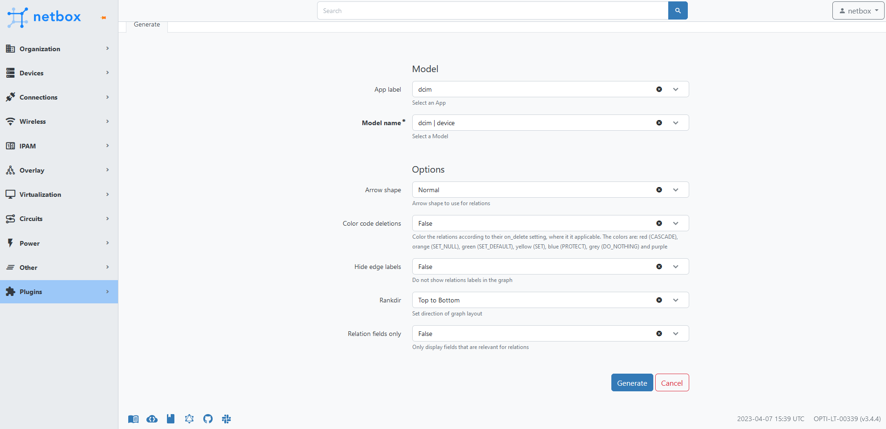

## App Walkthrough
The Entity Relationship Diagram plugin allows customization of the Model and rendering Options.

### App
A Django app is a self-contained module that provides a specific functionality or set of functionalities within a Django project.

### Model
A Django module is a file or collection of related files containing code that performs a specific task or set of tasks within a Django app or project.

### Arrow shape
- **Diamond**: The diamond shape represents a many-to-many relationship between two entities. For example, if an order can have multiple products and a product can belong to multiple orders, we would use a diamond-shaped arrow to represent this relationship.
- **Dot**: The dot shape represents an optional relationship. It indicates that the existence of one entity is not dependent on the existence of another entity. For example, if a customer may or may not have an order, we would use a dot-shaped arrow to represent this relationship.
- **Icurve**: The Icurve shape represents a self-referencing relationship, where an entity is related to itself. For example, if an employee has a supervisor who is also an employee, we would use an Icurve-shaped arrow to represent this relationship.
- **Inv**: The Inv shape represents a one-to-one relationship between two entities. It indicates that one entity is associated with one and only one instance of another entity. For example, if a person has only one social security number and a social security number is associated with only one person, we would use an Inv-shaped arrow to represent this relationship.
- **Tee**: The Tee shape represents a one-to-many relationship between two entities. It indicates that one entity is associated with many instances of another entity. For example, if a customer can have multiple orders, we would use a Tee-shaped arrow to represent this relationship.
- **Vee**: The Vee shape represents a disjoint subtypes relationship. It indicates that an entity can belong to one of several possible subtypes, but not more than one at a time. For example, if we have a vehicle entity with subtypes car and truck, we would use a Vee-shaped arrow to represent this relationship.
### Color code deletions
- **Red** (CASCADE): When an object that the foreign key references is deleted, all objects that have a foreign key to it are also deleted.
- **Orange** (SET_NULL): When an object that the foreign key references is deleted, the foreign key in all objects that reference it are set to NULL.
- **Green** (SET_DEFAULT): When an object that the foreign key references is deleted, the foreign key in all objects that reference it are set to its default value.
- **Yellow** (SET): When an object that the foreign key references is deleted, the foreign key in all objects that reference it are set to a specified value.
- **Blue** (PROTECT): Prevents deletion of the referenced object if any other object still references it through a foreign key.
- **Grey** (DO_NOTHING): Does nothing when an object that the foreign key references is deleted.
### Hide edge labels
Simplify and do not show relations labels in the graph

### Rankdir
ERD renders can be rotated around 90 degrees

### Relation Fields only
Further simplification for readability of the diagram

A render showing Icurve arrows, color code deletions whilst hiding edge labels with a left-to-right direction is shown below.

### Darkmode
Compatibility with Netbox's light and dark mode is also provided.

